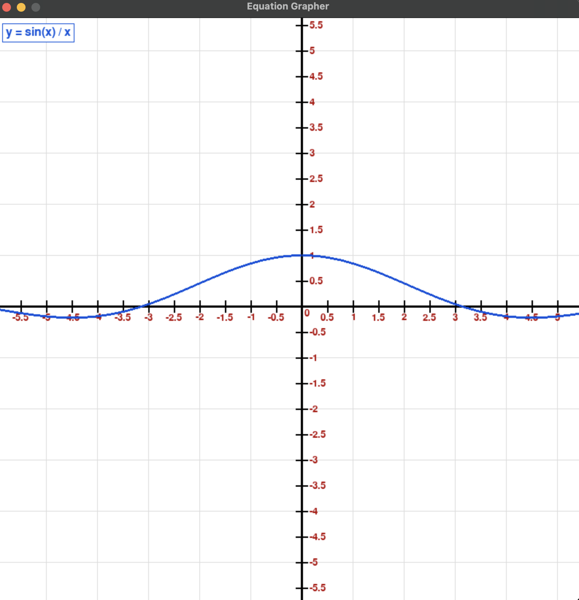

# Simulations

This repository contains a set of realistic scientific tools and simulations.

## Installation

- Install Python 3.12

- Install the required libraries
```
$ pip3 install -r requirements.txt
```

## Simulations

1. **Spinning Top:** a ball/spring model of a spinning top.

```
$ python3 spinning_top.py
>>> Enter the number of balls: 10
```

<video width="640" height="360" controls>
  <source src="demos/spinning_top.mp4" type="video/mp4">
  Your browser does not support the video tag.
</video>

2. **Pendulum:** a ball/spring model of a pendulum.

```
$ python3 pendulum.py
>>> Enter the ball mass: 500
>>> Enter the spring hardness: 100
```

<video width="640" height="360" controls>
  <source src="demos/pendulum.mp4" type="video/mp4">
  Your browser does not support the video tag.
</video>

3. **Projectile:** a realistic model for a projectile with friction.

```
$ python3 projectile.py
>>> Enter a value for the velocity (in pixel/s): 30
>>> Enter a value for the angle (0 to 90): 60
>>> Enter a value for the coefficient of friction (0 to 1): 0.1
```

<video width="640" height="360" controls>
  <source src="demos/projectile.mp4" type="video/mp4">
  Your browser does not support the video tag.
</video>

4. **Desmos:** a realistic clone of the math graphing calculator.

```
$ python3 desmos.py
>>> Equation Grapher — enter any expression in terms of x
Supports: sin, cos, tan, log, sqrt, exp, pi, e, abs, **  etc.
Examples:  x**2 + 3*x - 5
           sin(x) * x
           sqrt(abs(x))
Move graph by dragging. Zoom with UP / DOWN arrows. ESC to quit.

>>> Enter equation (y = ...): sin(x) / x
```
<p align="center">
    
</p>
